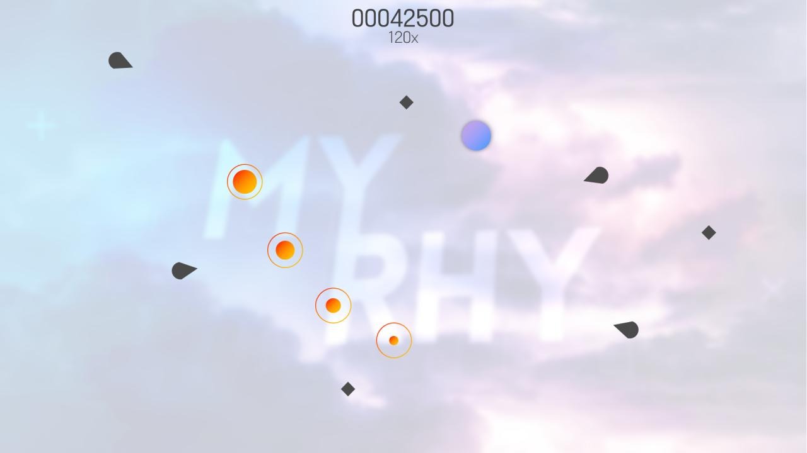

# MyRhy
이 페이지는 업데이트가 늦습니다!
 최신버전은 [여기](https://docs.google.com/document/d/1J2CWGoCVBbDc3XycSZsdcN0wxR0i1NJUHGb46083I9A/edit?usp=sharing)에서 확인 가능합니다.

> Avoid & Get on the tempo, MyRhy.

<table>
  <tr>
    <td>플랫폼</td>
    <td>Web(IE 미지원)</td>
  </tr>
  <tr>
    <td>개발</td>
    <td>Team Croissant</td>
  </tr>
  <tr>
    <td>장르</td>
    <td>리듬 탄막 슈팅 게임</td>
  </tr>
  <tr>
    <td>네트워크</td>
    <td>온라인</td>
  </tr>
  <tr>
    <td>배포</td>
    <td>미정</td>
  </tr>
  <tr>
    <td>목적</td>
    <td>영리</td>
  </tr>
</table>

[English](https://docs.google.com/document/d/1fdLmu9MksPkd7mX_BkppSZaGyWVya8OiO0FNyRgliv4/edit?usp=sharing) [日本語](https://docs.google.com/document/d/1VCP75DIeSmBQpBbVQzy8JxpW4wxe19Am2aYAdMgHRXE/edit?usp=sharing)

## 목차

1. 개요
2. 규칙
3. 채보 파일
4. 다시보기 파일
5. 점수 산출 방식
    1. 판정
    2. 각 판정에 대한 점수
6. 수익 창출
7. 계열 서비스
8. 수록곡

## 개요

노래에 맞춰 날아오는 탄(Bullet)들을 피하며 노트(Note)를 클릭하는 리듬게임. 탄은 화면 양측 벽에서 날아오며 벽에 부딪히거나 특정 명령어로 트리거될 때 사라집니다.

## 규칙

1. 총알은 좌우의 벽에서 날아옵니다.
2. 일반탄(원뿔형)은 좌우측 벽의 정해진 위치에서 생성되어 정해진 각도로 날아옵니다.
3. 조준탄(원형)은 좌우측 벽의 정해진 위치에서 생성되어 생성당시 플레이어의 방향으로 날아옵니다.
4. 플레이어는 벽을 제외한 모든 영역을 마우스로 이동할 수 있습니다.
5. 게임의 목적은 탄들을 피하며 노트를 클릭하는 게임으로, 노트를 놓치거나(MISS) 탄에 부딪히면 콤보가 깨집니다.
6. 한 곡당 탄에 20번 부딪히면 게임이 중단되며 중단시점의 점수가 저장됩니다.
7. Destroy 명령어로 총알을 벽에 닿는 판정 전에 파괴할 수 있습니다.

## 채보 파일(v1.0)

mry파일은 게임의 채보파일을 담은 파일입니다. 확장자는 .json으로, 정해진 규칙에 따라 작성되어야합니다.
이름의 규칙은 난이도.json이고, 파일의 규칙은 다음과 같습니다(n=number, s=string).

우선 채보파일의 최상단에는 다음과 같은 형식의 정보가 기록되어야 합니다.

“information” : { “version” : “n.n”, “track” : “s”, “producer” : “s”, “author” : “s”,  “bpm” : n, “speed” : n, “offset” : n}
 
(형식 : 버전 / 곡명 / 작곡가 / 채보제작자 / BPM / 속도 / 오프셋)

노래에 대한 정보기록 후에는 다음과 같은 형식의 명령어를 사용합니다.

patterns : [{ here }], bullets : [{ here }], triggers : [{ here }]
 
{ “ms” : n, “value” : “s”, “direction” : “s”, “location” : n, option } }
 
(형식 : ms / 고유값 / L/R / 위치 / { 고유정보 })

<table>
  <tr>
    <th>명칭</th>
    <th>ms</th>
    <th>고유값</th>
    <th>L/R</th>
    <th>위치</th>
    <th>고유정보</th>
    <th>상세설명</th>
  </tr>
  <tr>
    <td>일반노트</td>
    <td>n</td>
    <td>0</td>
    <td>-</td>
    <td>-</td>
    <td>{x,y}</td>
    <td>x : 노트의 x좌표(-100~100) y : 노트의 y좌표(-100~100)</td>
  </tr>
  <tr>
    <td>일반탄</td>
    <td>n</td>
    <td>0</td>
    <td>L/R</td>
    <td>-100~100</td>
    <td>{angle, speed}</td>
    <td>angle : -90~90 speed : 1~5</td>
  </tr>
  <tr>
    <td>조준탄</td>
    <td>n</td>
    <td>1</td>
    <td>L/R</td>
    <td>-100~100</td>
    <td>{speed}</td>
    <td>speed : 1~5</td>
  </tr>
  <tr>
    <td>Destroy</td>
    <td>n</td>
    <td>0</td>
    <td>-</td>
    <td>-</td>
    <td>{num}</td>
    <td>아직 Destroy처리 되지 않은 Bullet을 Destroy시킬 수 있습니다. num : n번째 Bullet의 번호 n</td>
  </tr>
  <tr>
    <td>Destroy All</td>
    <td>n</td>
    <td>1</td>
    <td>-</td>
    <td>-</td>
    <td>-</td>
    <td>모든 Bullet을 Destroy시킬 수 있습니다.</td>
  </tr>
  <tr>
    <td>BPM</td>
    <td>n</td>
    <td>2</td>
    <td>-</td>
    <td>-</td>
    <td>{BPM}</td>
    <td>특정 시점부터 채보의 BPM을 바꾸는 명령어입니다. BPM : n</td>
  </tr>
  <tr>
    <td>Opacity</td>
    <td>n</td>
    <td>3</td>
    <td>-</td>
    <td>-</td>
    <td>{opacity}</td>
    <td>채보 전체의 투명도를 조절하는 명령어입니다. opacity: 0~1</td>
  </tr>
</table>

## 다시보기 파일

MyRhy는 플레이의 다시보기를 지원합니다. 다시보기 파일의 확장자는 .json이며, 다음의 형식으로 작성되어야 합니다(n=number, s=string):

우선 파일의 최상단에는 노래의 이름과 사용자 설정 속도, 난이도가 기록되어야 합니다.

{ “track” : “s”, “producer” : “s”, “speed” : n, “difficulty” : n}
 
(형식 : 곡명 / 작곡가 / 속도 / 난이도)

위의 기록이 끝난 후에는 0.5초간격의 커서의 좌표를 기록합니다.

{ “x” : n, “y” : n }
 
(형식 : x / y)

위의 기록과 상관없이, 파일의 아무 위치에서 밀리초 기반의 클릭이벤트를 기록합니다.

{ “event” : “click”, “milis” : n }
 
(형식 : 이벤트명 / 밀리초)

## 점수 산출 방식

### 판정

+-60000 / BPM / 10(ms) : Perfect
 
+60000 / BPM / 6(ms) : Great
 
+60000 / BPM / 4(ms) : Bad
 
이외경우 또는 피격 : Miss

Bad와 Miss의 경우 콤보를 초기화시킵니다.

### 각 판정에 대한 점수

Perfect : score + combo * 200
 
Great : score + combo * 150
 
Bad : score + combo/2 * 50
 
Miss : score + 0

## 수익 창출

MyRhy는 영리 목적의 게임입니다.
 
구글 애드센스와 MyRhy Advanced 멤버십을 통해 수익을 창출합니다.

**구글 애드센스**
 
MyRhy 커뮤니티 최상하단에 게재, 본게임에는 적용하지 않습니다.
 
MyRhy Advanced 멤버십을 통해 없앨 수 있습니다.

**커서/벽/탄막 스킨**
 
스킨엔 무료 스킨도 있지만, 유료 스킨도 있습니다.

**MyRhy Advanced**
 
MyRhy의 하드유저를 위한 멤버십으로, 월 5,000-20,000원 또는 년 50,000-200,000원의 자유요금으로 이용할 수 있습니다.

제공되는 전용 기능
- 커뮤니티 광고 제거
- Advanced스킨 잠금해제
- 커스텀 스킨 제작 가능
- 채팅 아이콘♥과 색상 제공
- 베타버전 플레이 가능

## 계열 서비스

### 상위 서비스

- Team Croissant

### 하위 서비스

- MyRhy
    - MyRhy Editor
- MyRhy Community
- MyRhy Mirai
- MyRhy Twitter

## 수록곡
<table>
  <tr>
    <th>작곡가</th>
    <th>곡 이름</th>
    <th>음원 저작권 소유 단체</th>
  </tr>
  <tr>
      <td rowspan="4">Geoplex</td>
      <td>MyRhy Theme</td>
      <td>Team Croissant</td>
    </tr>
    <tr>
      <td>Chimera</td>
      <td rowspan="3">-</td>
    </tr>
    <tr>
      <td>Subvert</td>
    </tr>
    <tr>
      <td>Florescence</td>
    </tr>
    <tr>
      <td rowspan="2">VSNS</td>
      <td>Warrior</td>
      <td rowspan="2">VSNS Release</td>
    </tr>
    <tr>
      <td>Phantom</td>
    </tr>
    <tr>
      <td>SUReal</td>
      <td>The weight of time</td>
      <td>-</td>
    </tr>
    <tr>
      <td>Tido Kang</td>
      <td>필연(必然)</td>
      <td>-</td>
    </tr>
    <tr>
      <td>Elsiff</td>
      <td>Chatty Bones 2018</td>
      <td>-</td>
    </tr>
    <tr>
      <td>SVRGE</td>
      <td>GAMES</td>
      <td rowspan="5">Argofox Release</td>
    </tr>
    <tr>
      <td rowspan="2">Minerva</td>
      <td>Colors</td>
    </tr>
    <tr>
      <td>CLOUD_NINE</td>
    </tr>
    <tr>
      <td>Rewayde</td>
      <td>Shining Waves</td>
    </tr>
    <tr>
      <td>Hexalyte</td>
      <td>Horizon</td>
    </tr>
    <tr>
      <td rowspan="2">Canonblade</td>
      <td>Escape</td>
      <td rowspan="2">-</td>
    </tr>
    <tr>
      <td>Overcharge</td>
    </tr>
    <tr>
      <td>Sereno</td>
      <td>심야열차(深夜列車)</td>
      <td>-</td>
    </tr>
    <tr>
      <td rowspan="2">Sterrezo</td>
      <td>Zenith</td>
      <td rowspan="2">Twitter DM</td>
    </tr>
    <tr>
      <td>Fantasy</td>
    </tr>
    <tr>
      <td>Greenstar</td>
      <td>Bittersweet Adventure</td>
      <td>-</td>
    </tr>
</table>
